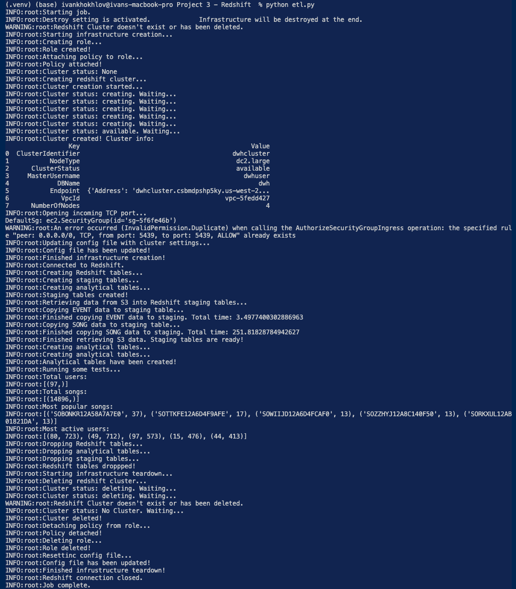

# Project: Redshift Data ETL from S3

This project was completed on 13th July 2021.

## Introduction

A startup called Sparkify wants to analyze the data they've been collecting on songs and user activity on their new music streaming app. 

All their data is stored in JSON files in AWS S3 buckets. The requirements are to load the JSON data from S3 into staging Redshift tables, and then transform the data into analytics tables so that it can be easily queried by Sparkify's analytics team.

This project hence contains:
1. Scripts for provisioning and managing AWS infrastructure. In particular Redshift.
2. Scripts for managing the ETL process for getting JSON data form S3, loading it into staging Redshift tables, and then transforming it.

## Quick Start Guide

1. Ensure Python 3.6+ is installed
2. Clone the repo: ```git clone https://github.com/aivoric/Data-Engineering-ND-Redshift-Project-3```
3. Enter the downloaded folder and create a virtual environment: ```python3 -m venv .venv```
4. Activate the virtual environment ```source .venv/bin/activate```
5. Install dependencies: ```pip install -r requirements.txt```
6. Open ```dwh_template.cfg``` and enter your AWS ```key``` and ```secret``` values
7. Rename ```dwh_template.cfg``` to ```dwh.cfg```
8. Run the full etl job ```python etl.py```

When you run the full job this will do all of the following tasks in just under 10 minutes:
1. Provision infrastructure
2. Create Redshift tables
3. Get data from S3 and store it in staging tables on Redshift
4. Transform the staging data into analytical tables in Redshift
5. Run test queries
6. Remove all infrastructure

If you want to run the job and not destroy the infrastrucure at the end, then open ```etl.py``` and
set ```destroy=False```.


## Notes on Files

```sql_queries.py``` contains all the SQL statements.

```infrastructure.py``` contains a class to manage infrastructure creation and teardown.

```redshift.py``` contains a class to manage Redshift table creation and dropping.

```data_manager.py``` contains a class to manage the data transformation process.

```etl.py``` contains the full ETL job which is run via the helper classes from the other files.

All other files can be ignored. The core code is based around the 3 helper classes located in the
files above as they do all the heavy lifting.

## Database Design

The database was designed with a star schema optimized for queries on song play analysis. 

The design includes a single fact table and 4 dimension tables.

3 of the dimension tables (users, songs, artists) are based around logical entities within Sparkify. The time dimension table was created for the purpose of being able to quickly join the table with songplays and query based on different time units.

Here is a summary of all the tables:

#### **Fact Table**

1. **songplays** - records in log data associated with song plays i.e. records with page `NextSong`
    - *songplay_id, start_time, user_id, level, **song_id**, **artist_id**, session_id, location, user_agent*

#### **Dimension Tables**

1. **users** - users in the app
    - *user_id, first_name, last_name, gender, level*
2. **songs** - songs in music database
    - *song_id, title, artist_id, year, duration*
3. **artists** - artists in music database
    - *artist_id, name, location, latitude, longitude*
4. **time** - timestamps of records in **songplays** broken down into specific units
    - *start_time, hour, day, week, month, year, weekday*

## A note on Upserts into Redshift

The songplays ETL job has been designed to support upserts. The other tables don't yet support that.

Upserts can be performed in Redshift, but are slightly tricky because Redshift is columnar storage database. Check the guide here:
https://docs.aws.amazon.com/redshift/latest/dg/merge-replacing-existing-rows.html

The way upserts are handled in this ETL is the following:
1. A SQL procedure is created (can be found inside the sql_queries.py file) which does the tasks outlined in the link above.
2. The procedure is then called and it completes various tasks, includes the creation of a temporary staging table.

## Handling Duplicates

For tables created based on the SONG staging data this is done simply by doing a GROUP BY on a DISTINCT column.

For the ```users``` table it's slightly more tricky since we are reading from the EVENTS staging data and we are only interested in the latest events from the user, and hence we would take the users metadata from that. This is solved via an INNER JOIN:

```
user_table_insert = ("""
    INSERT INTO users(
        SELECT
            a.user_id
            , a.first_name
            , a.last_name
            , a.gender
            , a.level
        FROM staging_events a
        INNER JOIN (
            SELECT user_id, MAX(ts) as ts
            FROM staging_events
            GROUP BY user_id
        ) b ON a.user_id = b.user_id AND a.ts = b.ts
        )
""")
```

An technical explanation about the above can be found here:
https://stackoverflow.com/questions/121387/fetch-the-row-which-has-the-max-value-for-a-column


## Full ETL job in the console

The full ETL job looks like this in the console:

